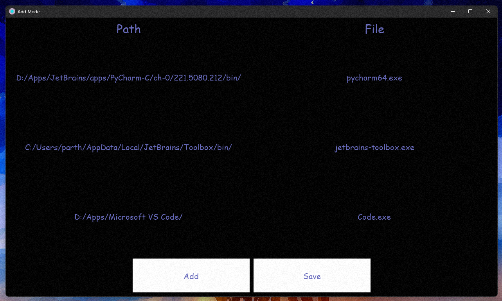
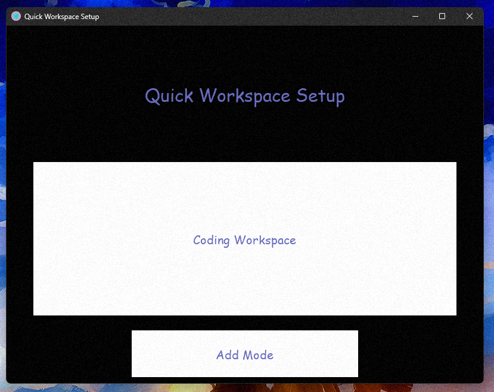

## ->What is QWS?

Quick Workspace Setup is an application that allows you to save your favourite programmes and files in a customised mode so that you may launch them all at once with a single click the next time!

## -> Some Screen Shots of the app

>

## ->Authors
[@parth25sareen](https://github.com/parth25sareen)

[@VikranthMaster](https://github.com/VikranthMaster)

## -> License
[This software is distributed under the MIT License](License.txt)