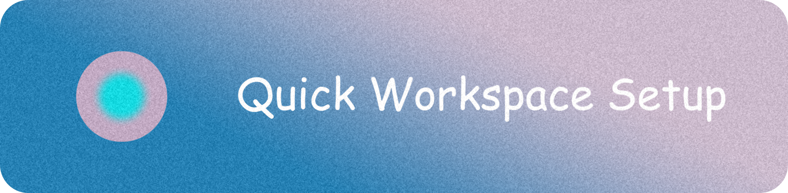
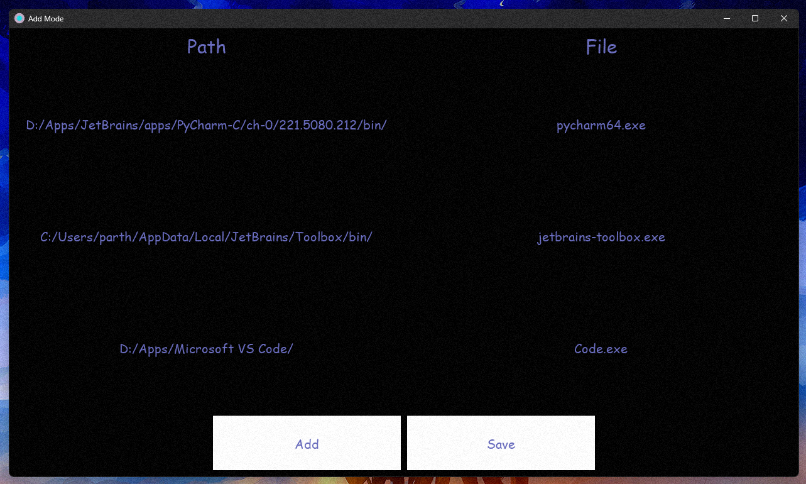
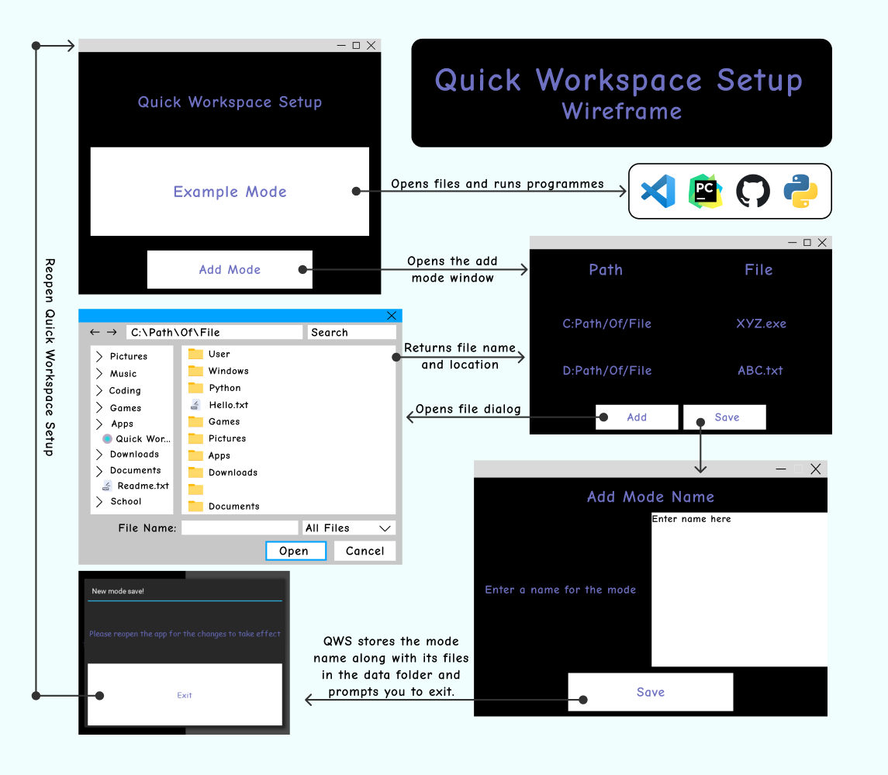

## <h1 style='color: #6366b7'> What is QWS? </h1>

> Quick Workspace Setup or QWS in short is an application that allows you to save your favourite programmes and files in a customised mode so that you may launch them all at once with a single click the next time!

## <h1 style='color: #6366b7'> Some Screen Shots of the app </h1>

>
>

## <h1 style='color: #6366b7'> Motivation </h1>
> Quick Workspace Setup is an app created with the intention of making the day-to-day work flow of creative individuals easier. The QWS Software Foundation wishes to maintain the QWS open source and has no plans to monetise it. QWS was designed with the user's privacy in mind, therefore it does not disclose any information online with any third party and can also run offline.

## <h1 style='color: #6366b7'> Wireframe </h1>

>

## <h1 style='color: #6366b7'> Download QWS</h1>

> Download the latest version of QWS from [here](https://github.com/parth25sareen/Quick-Workspace-Setup/releases/download/v1.0.1/QWS.Installer.exe).
>
> You may get the most recent version of QWS from our [website](https://parth25sareen.github.io/Quick-Workspace-Setup/website/home_1.0.html) or via [github releases](https://github.com/parth25sareen/Quick-Workspace-Setup/releases/tag/v1.0.1) 
>
> #### <b style='color: red'> _Note: When attempting to install it, please allow the installer to run as administrator, and when downloading, your browser may prompt unusual file because it has not been downloaded by many people._ </b>

## <h1 style='color: #6366b7'>Current Status</h1>

> Currently, v1.0 is ready for download, and we are working on v2.0, which will be available shortly.

## <h1 style='color: #6366b7'> Creator and Contributors </h1>
>[@parth25sareen](https://github.com/parth25sareen)
> 
>[@VikranthMaster](https://github.com/VikranthMaster)

## <h1 style='color: #6366b7'> License </h1>
> [This software is distributed under the MIT License.](LICENSE)

</body>
